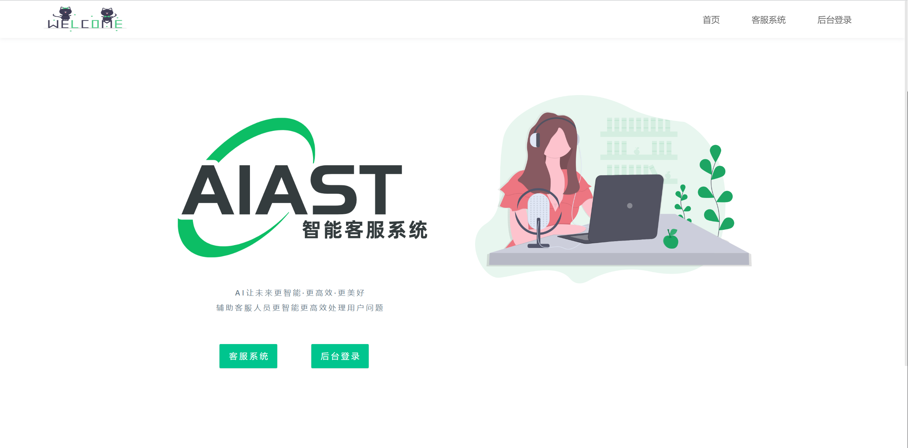
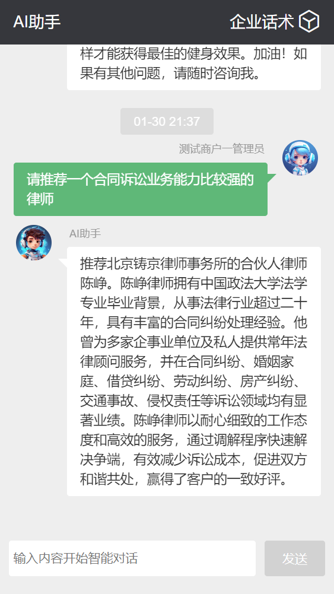
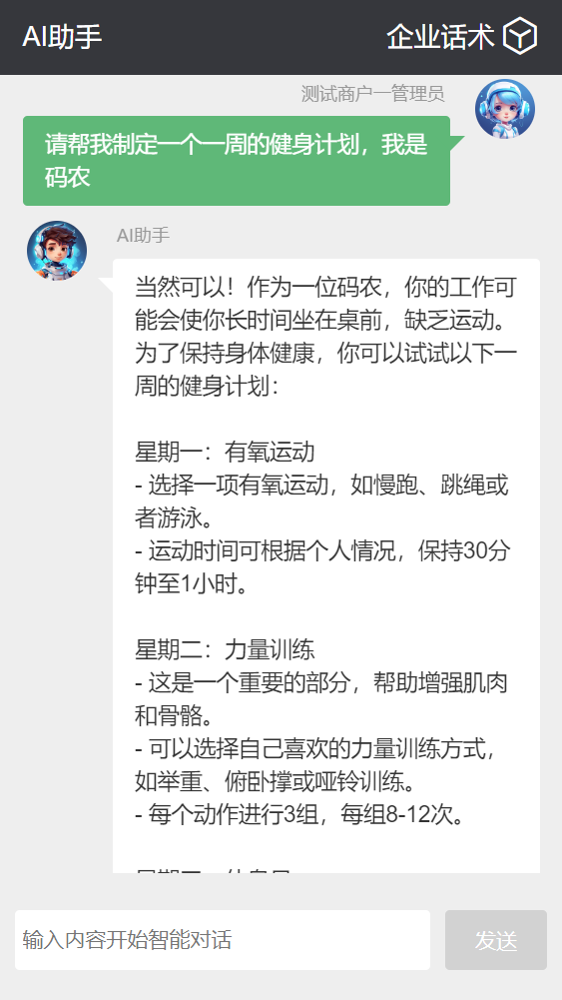
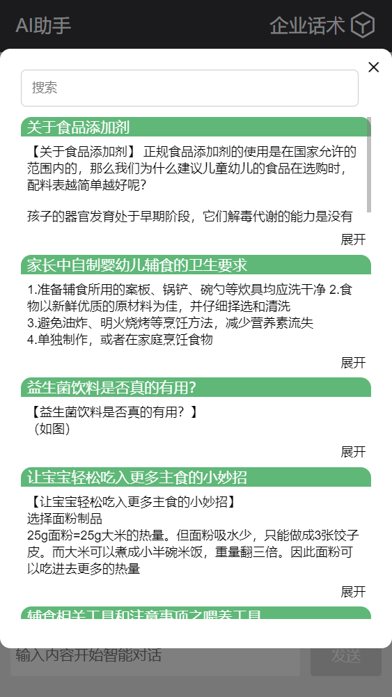
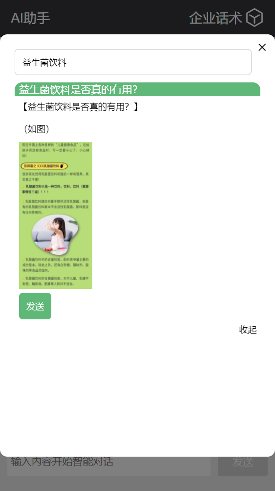
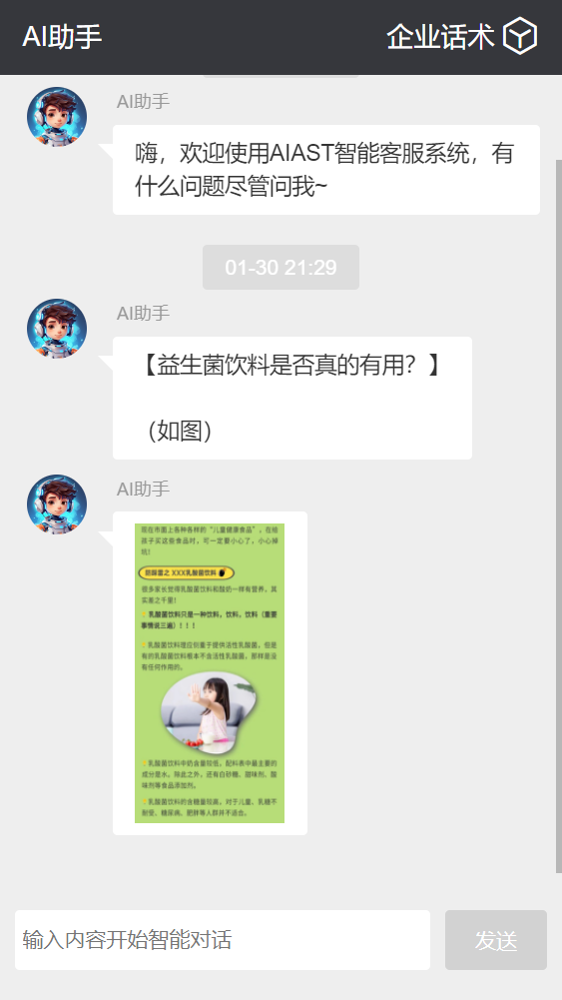

<h1 align="center">欢迎使用&nbsp;&nbsp;AIAST智能客服系统&AI知识库系统 👋</h1>

  
  

> AIAST智能客服系统，AI知识库系统，问答知识库，企业GPT知识库私有化，企业话术管理，支持API接口扩展调用🔮🤖🚀

### 🏠 [Homepage](https://github.com/pen9un/aiast-sys)

## 🚀使用说明

为提供更好的服务，需持卡密使用。支持API接口外部调用。如需了解更多，请进微信群，如有问题请联系管理员。

**使用见群公告和系统使用手册。** 请先详阅群公告和系统使用手册，后有问题再在交流群沟通。

**微信交流群**（如二维码失效请点 **Star** 耐心等候或提 [Issues](https://github.com/pen9un/aiast-sys/issues) ，会在第一时间更新二维码。进群后先看群公告，如有需要加群管理员，需备注 **AIAST智能客服系统** 并说明加好友原因）：

## 🔮系统介绍

**AIAST智能客服系统，不止是客服系统，更是强大的AI知识库系统。**

系统介绍请详阅：[你有一套新的系统请查收—AIAST 智能客服系统](https://mp.weixin.qq.com/s/AsmMHnMG-4iLTeQ6e7iITg)

系统使用手册：https://uwcly5i1xs.feishu.cn/docx/KwzWdQ87HolEsjxxlimcgJNVnfe

AIAST（AI Assistant）智能客服系统，服务于企业、客服、电商等各类与客户沟通人员，旨在提升企业与客户之间的沟通效率和用户体验。基于企业自有话术知识库，结合人工智能技术，为企业客服人员提供智能检索、话术管理、知识库对话等一系列强大功能，辅助客服人员更智能更高效更专业更便捷处理客户问题。

**AIAST智能客服系统，主要服务对象为客服人员，打通客服和用户沟通的高速智能通道，为客服人员提供企业话术数据基础，同时结合ChatGPT强大的语义理解、跨行业特性，可以为客服人员提供更智能更专业更有情感的话术内容，在处理客户问题时游刃有余。**

除企业客服外，其它应用场景、行业同样适用：

- 企业话术知识库管理维护
- 客服从业人员
- 电商从业人员
- 微商从业人员
- 问答知识库管理维护
- 对接微信、钉钉、飞书
- 其它适用场景

**A I 让 未 来 更 智 能 · 更 高 效 · 更 美 好**

## 效果展示

### 知识库智能对话

管理员或其他用户在后台转换话术数据为知识库文件数据或导入企业知识库后，同时打开知识库管理中的知识库客服对话开关，即可在客服系统中使用知识库智能对话功能。

### ChatGPT 智能对话

管理员或其他用户在后台配置好ChatGPT API Key数据和ChatGPT角色指令后，同时关闭知识库管理中的知识库客服对话开关，即可在客服系统中使用ChatGPT智能对话功能。

ChatGPT智能对话示例：

### 企业话术对话

### 话术数据展示

### 查看检索话术数据

### 发送到聊天对话框

### 复制转发话术

手机端和PC电脑端都可以双击话术文字内容或图片内容进行复制或查看，同时支持粘贴或分享给其他用户或其它端。

## 核心功能

**系统核心功能有 ：**

- **客服系统**（手机电脑适配、话术标题&内容智能检索、知识库提问、ChatGPT智能提问等）
  - 企业话术对话
  - ChatGPT 智能对话
  - 知识库智能对话
  - 对话管理
- **商户管理员**（管理维护企业组织下所有用户、数据菜单权限、知识库、话术等数据）
  - 成员管理
  - ChatGPT 管理
  - 话术管理
  - 知识库管理
- **话术管理**（批量导入、智能检索、记忆功能等）
  - 手动新增或批量导入话术
  - 话术文件管理
  - 话术转知识库
- **知识库管理**
  - 话术转知识库
  - 话术资料上传
  - 智能客服系统对话管理
- **对话管理**
  - ChatGPT 管理（多账号轮询、支持自定义角色指令、调用次数记录等）
  - 对话记录管理
- **API 接口**（系统开放 API 接口供外部系统调用）

## 使用方法

详见系统使用手册：https://uwcly5i1xs.feishu.cn/docx/KwzWdQ87HolEsjxxlimcgJNVnfe

## 📖更新日志

- 2024-01-01 开发 2.0 版本，增加商户模式
- 2023-06-25 系统诞生

## 🤝作者

👤 **pen9un**

* Website: https://github.com/pen9un/
* Github: [@pen9un](https://github.com/pen9un)

## ❤️支持

如果觉得此项目有用，请点一个免费的小 ⭐️⭐️

## ✨Star History

